## Presentacions - *Qui soc?*

::: columns
::: {.column width="45%"}

\onslide<1->

### Currículum

\onslide<1->

- Enginyer i Doctor en Informàtica per la [UdL](http://www.udl.cat/).

\onslide<2->

### Docència

- Professor **lector** a la [UdL](http://www.udl.cat/) des de 2019.
- Sistemes Operatius (*GTIDIC*, *GEI*).
- Administració de Sistemes (*GTIDIC*, *GEI*).
- Desenvolupament d'Aplicacions per a dispositus mòvils (*GTIDIC*).
- Cloud Compunting (*Master in Health Data Science*)
- High Performance Computing (*Màster en Enginyeria Informàtica*)
:::
::: {.column width="45%"}

\onslide<3->

### Recerca

- Membre del grup de recerca [**Grup de computació distribuïda**](http://gcd.udl.cat) des de 2012 (Universitat de Lleida).
- Membre del grup de recerca [**Essence: Data Engineering & Distributed Computing Systems**](https://www.dcs.gla.ac.uk/essence/index.html) des de 2022 (Universitat de Glasgow).
- Computació distribuïda: *Cloud, Edge i Fog Computing*.
- Camps d'aplicació: *Salut electrònica i Energia*.

:::
:::

# Introducció al curs

## Presentació

:::center
[**Benvinguts a Sistemes Operatius**]{.alert}
:::

::: columns
::: {.column width="65%"}

```c
char text[] = "Aquesta NO és una assignatura\n\
      centrada en la  programació\n\
      PERÒ programarem MOLT!\n";
ssize_t bytes = write(1, text, sizeof(text) - 1);
```

```bash
text="Aquesta assignatura NO és un MONÒLEG." 
echo $text
```

:::center
Vull sessions interactives, participatives,... pregunteu, interrompeu-me...
:::

:::
::: {.column width="30%"}

:::center
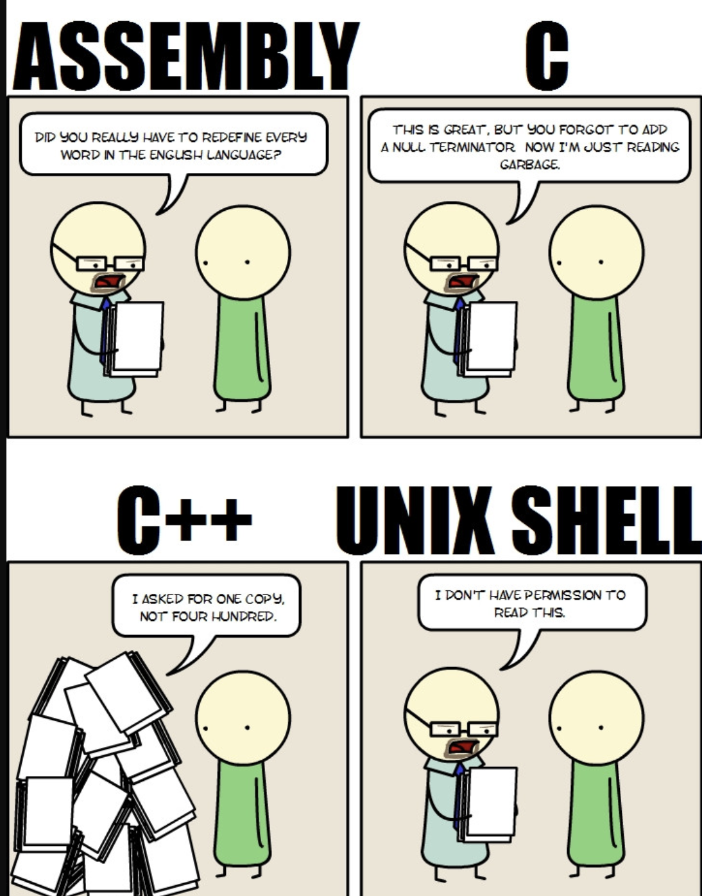{width=100%}
:::

:::
:::

## Objectius (Globals)

> - Determinar les característiques funcionals i el disseny dels elements que conformen un **Sistema Operatiu**.
> - Analitzar la importància de cadascun dels mòduls que integren un **Sistema Operatiu**.
> - Identificar els diferents serveis que proporciona el **Sistema Operatiu** en l'àmbit d'usuaris i d'aplicacions.
> - Utilitzar de forma eficient els serveis proporcionats pel **Sistema Operatiu** per al disseny i desenvolupament d'aplicacions informàtiques.
> - Analitzar críticament les característiques i el funcionament de les polítiques que integren un **Sistema Operatiu**.
> - Comparar de forma crítica els diferents mecanismes de gestió de la memòria.

## Objectius (Específics)

> - Conèixer els sistemes operatius Unix/Linux (en concret **Debian**).
> - Experimentar la programació en l'àmbit de sistema.
> - Interioritza les bases de programació *C* per millora les vostres habilitats en altres llenguatges.

## Temari

> - Introducció als Sistemes Operatius.
> - Estructura dels Sistemes Operatius.
> - Gestió i comunicació de processos i threads.
> - Sincronització i Planificador de tasques.
> - Interbloqueig.
> - Gestió de Memòria.
> - Scripting.

\onslide<8->

### Propòsit

Els estudiants aprendreu a desenvolupar programari a nivell de sistema en el llenguatge de programació **C** comprenent al mateix temps com funcionen els **Sistemes Operatius** basats en **Unix**.

## Metodologia

\onslide<1->

:::center
Basada en \blueArrow Aprenentatge **SIGNIFICATIU**, **GUIAT** i **ACTIU**.
:::

\onslide<2->

- **Sessions teòriques**: S’introdueixen continguts teòrics de l’assignatura i als estudiants, i també s’hi discuteixen les implicacions pràctiques.
  - Diapositives (pdf i html).
  - Vídeos (youtube).

\onslide<3->

- **Sessions pràctiques**: sessions autoguiades de laboratori, sessions de *live coding* o resolució de problemes.

\onslide<4->

- **Treball autònom**:  els estudiants  han d'aplicar els coneixements adquirits a les sessions teòriques i pràctiques per acabar els problemes, laboratoris i projectes proposats. A més, han de realitzar les lectures dels apunts i consultar la bibliografia recomanada.

\onslide<5->
:::center
Les sessions teòriques i pràctiques estan combinades en les sessions de 3h de durada.
:::

## Avaluació

\onslide<1->

### Criteris d'Avaluació

| Acr. | Activitat d'avaluació    | Pes   | Nota mínima | En grup         | Recuperable |
|------|--------------------------|-------|-------------|-----------------|-------------|
| **E1**   | **Primer Parcial**           | **42,5%** | **NO**          | **NO**              | **SI**          |
| **E2**   | **Segon Parcial**            | **42,5%** | **NO**          | **NO**              | **SI**          |
| **P**    | **Projecte**                 | **10%**   | **NO**          | **SI $\leq 2$**     | **NO**          |
| P1   | Projecte 1               | 5%    | NO          | SI $\leq 2$     | NO          |
| P2   | Projecte 2              | 5%     | NO          | SI $\leq 2$     | NO          |
| **Part** | **Seguiment i Participació** | **5%**    | **NO**          | **NO**    | **NO**          |

\onslide<2->

### Extra

1. **Manteniment de notes setmanals** (*fins a 10%*).
2. **Correcció, detecció i millora dels materials** (*fins a 10%*).

## Extra: Manteniment de Notes Setmanals

::: columns
::: {.column width="45%"}

\onslide<1->

- **Objectiu**: Fomentar la reflexió i l'autoavaluació dels continguts treballats a classe.
- **Metodologia**: Cada setmana, els estudiants han de fer un commit al seu repositori d'apunts amb les notes de les sessions de teoria i pràctiques.
- **Avaluació**: Es valorarà la qualitat de les notes, la seva coherència i la seva relació amb els continguts treballats, així com les reflexions i opinions personals incloses.

:::
::: {.column width="45%"}

\onslide<2->

### Exemple de Notes

```markdown
## Setmana X

# Resum teòric

# Exemples pràctics

# Dubtes i preguntes

# Reflexions personals
```

:::
:::

## Extra: Correcció, Detecció i Millora dels Materials

\onslide<1->

Els materials de l'assignatura segueixen la metodologia de *Open Source*. Això vol dir que qualsevol estudiant pot detectar errors, millorar els materials o afegir continguts nous. Per tant, cada estudiant pot fer *fork* del repositori de l'assignatura i fer *pull request* amb les seves correccions i millores.

\onslide<2->

\smartdiagram[flow diagram:horizontal]{
  \textbf{↓} Pull \texttt{(git pull)},
  Create a branch \texttt{(git branch)},
  Make Changes,
  \textbf{↑} Push Changes \texttt{(git push)},
  Pull Request
}

\onslide<3->

- **Branca Main**: Reservada per estar sincronitzada amb els materials oficials.
- **Branques de treball**: Cada estudiant pot crear una branca per fer canvis i millorar els materials.

\onslide<4->

S'avaluarà la quantitat i qualitat de les correccions, deteccions i millores realitzades en els materials de l'assignatura.

## Normativa del curs (I) - *Assistència i Seguiment*

> - L'**assistència a les sessions de teoria i pràctiques** és **obligatòria** però altament *recomanable*.
> - **Seguiment i Participació**: Es valorarà la participació activa a les sessions de teoria i pràctiques, així com la realització i entrega dels exercicis i problemes proposats.
> - Els projectes pràctics no són obligatoris, i es poden realitzar en grup de fins a 3 persones.
> - Es demana que els estudiants arribin puntuals a les sessions. L'entrada tardana pot interrompre la dinàmica de la classe i el treball dels companys.

## Normativa del curs (II) - *Gestió dels grups*

> - Cada estudiant és responsable de la seva pròpia feina i de com gestiona el seu temps. L'assistència a classe no és obligatòria, però és altament recomanable per garantir el seguiment adequat de l'assignatura.
> - Durant les sessions de laboratori, es fomenta el treball en grup, sempre de manera ordenada i respectuosa envers els companys.
> - Cada alumne ha de presentar evidències pròpies del treball realitzat, encara que es col·labori en grup.

## Normativa del curs (III) - *Exàmens i Avaluació*

> - Els exàmens són escrits i no està permès l'ús d'ordinadors. Es permetrà una fulla manuscrita mida A4 amb apunts, notes, etc.
> - Els parcials avaluaran els coneixements teòrics i pràctics de l'assignatura.
> - L'ús d'eines d'intel·ligència artificial està permès durant el curs, sempre que no es limiti a un simple copiar i enganxar. Heu de justificar les vostres respostes amb reflexions i opinions personals.

## Eines necessàries

\onslide<1->

- Ordinador portàtil amb connexió a Internet.
  - Es recomana portar el vostre propi ordinador per cursar l’assignatura.
  - Si no disposeu d’ordinador, podreu utilitzar els ordinadors de la classe durant les sessions de laboratori.

\onslide<2->

- Distribucions Linux ([Debian](https://www.debian.org/index.ca.html) )
  - És obligatori utilitzar la distribució Debian per a les pràctiques de laboratori.

\onslide<3->

- Software de virtualització (VMWare)
  - Es recomana utilitzar VMWare, però podeu optar per altres opcions de virtualització. Heu de ser capaços d’adaptar el material al vostre programari de virtualització.

## Programari necessari

\onslide<1->

### Llenguatges de programació i compiladors

- C
- [GCC](https://gcc.gnu.org/)

\onslide<2->

### Eines de control de versions

- [Git](https://git-scm.com/)
- [Github](https://github.com/)

\onslide<3->

### IDE

- Visual Studio (Recomanat)
- Vi, Vim, NeoVim, Emacs, CLion, Eclipse ...

## Materials i Recursos

\onslide<1->

- Apunts de l'assignatura i materials complementaris proporcionats pel professor al campus virtual.

\onslide<2->

- Laboratoris i activitats pràctiques disponibles al repositori de l'assignatura.

\onslide<3->

- Documentació oficial de les eines i tecnologies utilitzades.

\onslide<4->

- Fòrums tècnics a la xarxa com *Stack Overflow, Reddit*, etc.

\onslide<5->

- Llibres de referència en Sistemes Operatius:
  - [Operating System Concepts; Abraham Silberschatz](https://www.amazon.com/Operating-System-Concepts-Abraham-Silberschatz/dp/0470128720)
  - [Modern Operating Systems; Andrew S. Tanenbaum](https://www.amazon.com/Modern-Operating-Systems-Andrew-Tanenbaum/dp/013359162X)

## Bones pràctiques

> - DRY (Do not repeat yourself).
> - Codi fàcil de reutilitzar.
> - Testeja aviat, testeja sovint, testeja de forma automàtica.
> - No assumeixis res, prova-ho.
> - Utilitza assertions per prevenir l'impossible.
> - Utilitza excepcions per problemes excepcionals.
> - Estima l'ordre de complexitat dels teus algorismes.
> - Utilitza patrons de disseny.
> - Utilitza eines de control de versions.

## Bibliografia recomanada (per la vida... no pel curs)

::: columns
::: {.column width="45%"}

[The Pragmatic Programmer, Andrew Hunt David Thomas](https://www.amazon.es/Pragmatic-Programmer-Journeyman-Master-ebook/dp/B003GCTQAE)

&nbsp;

:::center
{width=30mm}
:::
:::

::: {.column width="45%"}

[Clean Code, (A Handbook of Agile Software Craftsmanship),Robert C. Martin](https://www.amazon.es/Clean-Code-Handbook-Software-Craftsmanship-ebook/dp/B001GSTOAM)

&nbsp;

:::center
{width=30mm}
:::

:::
:::

# Introducció a la temàtica

## Societat actual

::: columns
::: {.column width="20%"}

### Què tenen en comú?

> - Cotxe
> - Rellotge
> - Portàtil
> - PC
> - Tablet
> - Rentadora
> - Nevera
> - Televisió
> - ...

:::
::: {.column width="75%"}

::: center
{width=90%}
:::

:::
:::

## Món connectat

\onslide<1->

::: center
Avui en dia tothom parla de **IoT**, **BigData**, **Cloud**, **AI**, **Blockchain**, **Metavers**
:::

::: columns
::: {.column width="45%"}

> - Microprocessador a tot arreu.
> - Xarxes i Connectivitat.
> - Serveis escalables, confiables i segurs.
> - Gran volum de dades, Sensor i Digitalització.

:::
::: {.column width="45%"}

:::center
)](https://d3i71xaburhd42.cloudfront.net/65ec75e721634b392d23364f8d67a68aedc1c189/15-Figure9-1.png){width=70mm}
:::

:::
:::

\onslide<6->

::: center
La barrera que separa el món físic i el món virtual cada cop es mes estreta.
:::

:::notes

En la societat actual es parla constatant de noves tecnologies disruptives com **IoT**, **BigData**, **Cloud**, **AI**, **Blockchain**, **Metavers**,... Això fa que vivim en un món connectat on tots els dispositius són capaços de generar dades; per exemple, vivim envoltats de dispositius mòbils i sensors de tot tipus, també tenim servidors en centres de dades distribuïts per tot el món (inclús a sota el mar) i també serveis capaços de processar i emmagatzemar grans quantitats de dades i d'informació.

Per tant, com a societat tenim la capacitat d'interactuar amb el nostre entorn i ambient.

- Quants teniu un cotxe? Quants processadors creieu que té un cotxe?
  - Més de 50!
- Qui utilitza un smartphone? Quants processadors/cores té el vostre smartphone?
  - El meu un Poco X4 GT té un MediaTek Dimensity 8100 amb 8 nuclis!

Tots els dispositius que fem servir de forma quotidiana són sistemes paral·lels que funcionen i interactuen entre ells. Per tant, podem afirmar que el món és un gran sistema paral·lel.
:::

## Què tenen en comú aquests progressos tecnològics?

::: center

{width=60%}

Una **interfície** (*Sistema Operatiu*) capaç **d'integrar una gran diversitat de maquinari i programari** i **comunicar-se a través de la xarxa**.

:::

::: notes

Però, **que tenen en comú aquests progressos tecnològics?**
Requereixen un cervell que permeti a tots els diferents aparells i màquines interactua amb nosaltres, tant per generar, processar o guardar. Tots els dispositius i servidors requereixen un sistema operatiu que permeti maquinari i programari comunicar-se.

En aquest curs tractarem els cervells d'aquests sistemes i analitzarem de quines estructures podem dotar aquests sistemes perquè funcionin correctament i permeti que maquinari tan heterogeni sigui capaç de fer funcionar infinitat de programes i serveis \blueArrow per gestionar eficientment les dades i la informació del nostre entorn.

Per tant, a la pregunta inicial què tenen en comú? podem afirmar:

- Tenen en comú que tots són sistemes informàtics.
- Tots tenen un sistema operatiu.
- Tots es communiquen per internet amb altres sistemes.
:::

## Què són les lleis de Moore i Bell?

::: columns
::: {.column width="45%"}

\onslide<1->

{width=90%}

:::
::: {.column width="45%"}

\onslide<2->

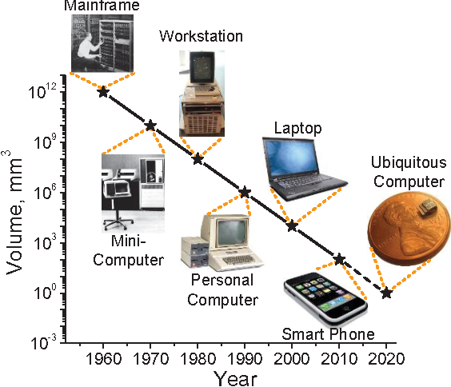{width=80%}

:::
:::

\onslide<3->

:::center
> Venim de pocs processadors fets servir per a moltes persones (anys 60-70) i ara cada persona fa servir molts processadors. Com ha canviat la tendència... on ens portarà el futur?
:::

::: notes
En aquestes dues figures podeu observar la llei de moore i la llei de bell. En la primera figura, es pot observar com la capacitat dels microprocessadors s'ha anat duplicant cada dos anys sense tenir en compte el cost. En la segona figura es pot observar com la mida i les classes de computadors han evolucionat cada 10 anys.

Venim de la dècada dels anys 60 i 70, on es van desenvolupar els primers microprocessadors i la informàtica personal estava en les seves primeres etapes. En aquesta època, es feien servir pocs processadors que eren compartits per moltes persones. Els avanços en la capacitat de processament eren més lents, i la tecnologia era més limitada.

Ara, en l'actualitat, cada persona fa servir molts processadors de manera habitual. Això es deu a l'augment de la potència de processament dels dispositius que utilitzem, com els telèfons intel·ligents i les tauletes, així com als ordinadors personals i altres tecnologies.

Pel que fa al futur, podem esperar que la tendència continuï amb l'augment de la capacitat de processament i la miniaturització de la tecnologia. Això pot tenir un impacte significatiu en molts àmbits de la vida, com la informàtica, la medicina, la intel·ligència artificial i molts altres. No obstant això, també s'han plantejat preocupacions sobre els límits físics d'aquest creixement i els impactes ambientals associats a l'augment de la producció tecnològica.
:::

## Què és un sistema informàtic?

\onslide<1->

Un **sistema informàtic** és la interconnexió d'elements de maquinari per exemple [d'1 o més CPU, memòria]{.alert} i components E/S ... Amb la finalitat d'executar programes i accions (en sèrie o de forma concurrent) per [1 o múltiples usuaris]{.alert}.

::: columns
::: {.column width="30%"}

\onslide<3->

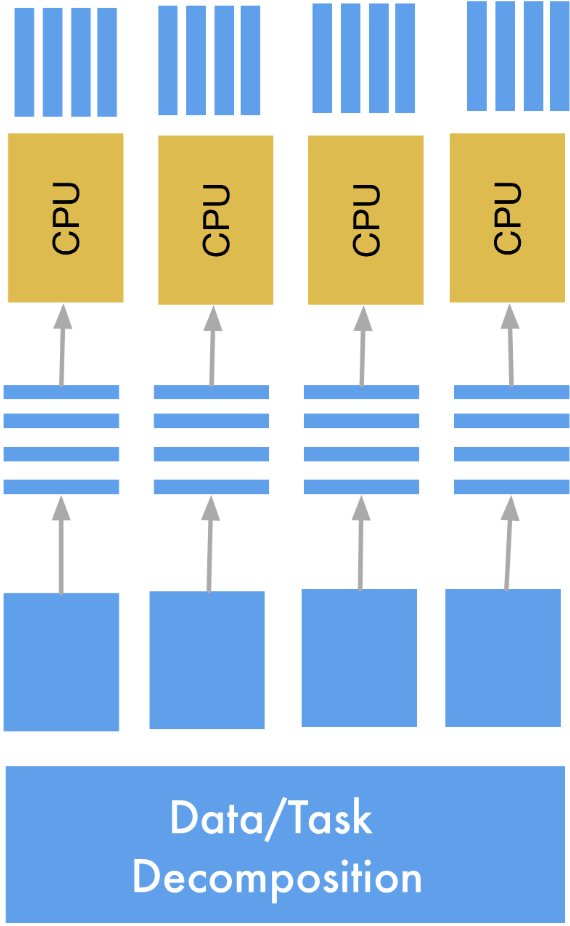{width=55%}

:::
::: {.column width="60%"}

\onslide<2->

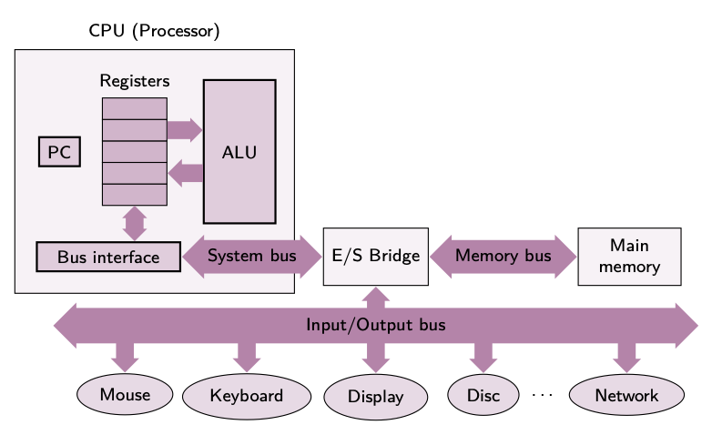{width=90%}

:::
:::

::: notes

Un **sistema informàtic** és la interconnexió d'elements de maquinari per exemple [d'1 o més CPU, memòria]{.alert} i components E/S ... Amb la finalitat d'executar programes i accions (en sèrie o de forma concurrent) per [1 o múltiples usuaris]{.alert}.

**Per què necessitem la concurrencia?**

Com heu vist el mon real actua com un gran sistema paral·lel. Per tant, tots els sistemes de temps real son inherentment concurrents i lògicament els nostres sisteme informàtics també han de poder actuar en paral·lel. En la figura, podeu observar com una tasca es descomposa en diferents parts per poder aprofitar els diferents processadors i nuclis de cada processador.

L'execució **concurrent** recull un conjunt de tècniques informàtiques usades per representar i gestionar el paral·lelisme i les eines de sincronització i comunicació entre programes.

:::

## Gestió d'un sistema informàtic (I)

\onslide<1->

::: cbox
Quantes vegades com a usuaris d'un sistema informàtic llegiu un fitxer?
:::

\onslide<2->

::: cbox
Imagineu que sou un sistema informàtic i us envien l'ordre de llegir un fitxer? Quins és el procediment per fer aquesta acció?
:::

## Gestió d'un sistema informàtic (II)

\onslide<1->

### Quantes vegades com a usuaris d'un sistema informàtic llegiu un fitxer?

Moltes vegades...!

\onslide<2->

### Imagineu que sou un sistema informàtic i us envien l'ordre de llegir un fitxer? Quins és el procediment per fer aquesta acció?

\onslide<3->

- Engegar motor del disc.
  
\onslide<4->  

- Buscar posició al disc a llegir (pista, cara, sector).

\onslide<5->

- Llegir.

\onslide<6->  

- Apagar el motor.

::: notes
Cada usuari de forma activa (llegir un document) o passiva (el vostre sistema operatiu llegeix molts fitxers únicament per arrancar...).

Per fer-ho el sistema opartiu té que indicar al disc que engegi el seu motor, es situi a la posició a llegir, llegeixi aquella posició i la transfereixi, i finalment apagui el motor.

*Té sentit que un usuari cada cop que llegeix un fitxer hagi de tenir en compte aquest procediment i realitzar-lo de forma rutinària?* Necessitem un programari que ens permeti efectuar accions rutinàries de forma automàtica i transparent a l'usuari. Si no els sistemes informàtics no serien usables.
:::

## Complexitat dels sistemes informàtics (I)

\onslide<1->

:::center
Cada peça de hardware és diferent \blueArrow La complexitat per gestionar els recursos és molt elevada.
:::

\onslide<2->

- Arquitectures diferents de processadors i també de generacions (x86,ARM, RISC-V,MIPS, PowerPC,...).

\onslide<3->

- Diferents tipus de memòries (RAM DDR3, DDR4, DDR5, NAND,... ).
  
\onslide<4->

- Diferents tipus de discs (HDD o SSD).
  
\onslide<5->

- Diferents dispositius entrada/sortida.
  
\onslide<6->

- Diferents entorns de xarxa.

\onslide<7->

:::center
[... entre moltes altres ...]{.alert}
:::

:::notes
Us imagineu haver d'escriure software per cada permutació d'elements diferents del sistema informàtic? Això seria un desastre...
Quantes permutacions de diferents components podem tenir avui en dia? OMG!
Necessitem alguna cosa que ens permeti superar aquest obstacle de forma intel·ligent i ens permeti desenvolupar software de forma independent al hardware.
:::

## Complexitat dels sistemes informàtics (II)

\onslide<1->

::: cbox
Tots els programes necessiten accedir a tot el hardware?
:::

\onslide<2->

::: cbox
Què pot passar si un programa pot accedir a tota la RAM?
:::

## Complexitat dels sistemes informàtics (III)

\onslide<1->

### Tots els programes necessiten accedir a tot el hardware?

\onslide<2->

Per suposat que no! Això podria causar problemes de seguretat com:

\onslide<3->

- **Pèrdua de confidencialitat**: Accés no autoritzat a dades sensibles.

\onslide<4->

- **Accés a informació restringida**: Usuaris no autoritzats podrien veure dades privades.

\onslide<5->

- **Denegació de serveis**: Un programa podria bloquejar l'accés a recursos per a altres programes.

\onslide<6->

### Què pot passar si un programa pot accedir a tota la RAM?

\onslide<7->

- Un programa de l'usuari Jordi amb accés a tota la RAM podria veure les dades del programa de l'usuari Pere.

\onslide<8->

- Si el programa falla, podria afectar tot el sistema i requerir un reinici.

:::notes
No, clar que no!

**Seguretat**:

- Si un programa controla tot el sistema, els altres no poden accedir-hi (Denegació de serveis).
- Diferents usuaris poden tenir diferents dades; si un programa pot accedir a tot, podria veure informació restringida.
- No necessitem accés a tot el hardware per realitzar les nostres tasques.
- Un usuari malintencionat podria danyar el sistema amb un procés defectuós.

:::

## Complexitat dels sistemes informàtics (IV)

\onslide<1->

### Un programa pot fer fallar tot el sistema?

\onslide<2->

::: columns
::: {.column width="45%"}

```c
int main(){
    while(1);
}
```

:::
::: {.column width="45%"}

\onslide<3->

```c
int main(){
    while(1);
    fork();
}
```

:::
:::

::: notes

Un programa o procés pot fer fallar tot el sistema si no està ben dissenyat. Per tant, és important tenir en compte aqueixes situacions per evitar-les.

En el primer exemple, tenim un bucle infinit. Aquesta situació en els sistemes linux actuals no és un problema, ja que el sistema operatiu pot gestionar aquest tipus de situacions. No obstant això, en sistemes més antics, aquest tipus de bucles podrien fer que el sistema no respongués.

En el segon exemple, tenim un bucle infinit i una crida a la funció fork(). Aquesta funció crea un nou procés que és una còpia exacta del procés pare. Això podria fer que el sistema es saturés amb molts processos i no pogués respondre. Aquesta situació podria requerir un reinici del sistema per recuperar-lo i es un problema en els sistemes actuals.

Fixeu-vos com un simple programa pot fer fallar tot el sistema.

:::

## Què és un sistema operatiu?

\onslide<1->

Un  **sistema  operatiu (SO)**  és  una  capa  de  software  que  permet  la comunicació i la gestió del maquinari habilitant als usuaris l’execució de programes. El SO actua d’**intermediari (interfície)** entre els **usuaris i el maquinari**.

\onslide<2->

::: center
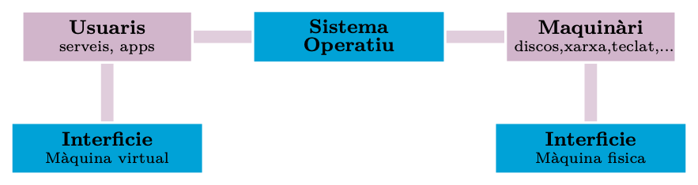
:::

::: notes

Un **sistema operatiu (SO)** és una capa de software que permet la comunicació i la gestió del maquinari habilitant als usuaris l’execució de programes. El SO actua d’**intermediari (interfície)** entre els **usuaris i el maquinari**.

Per tant, és un programa que controla el maquinari i permet als usuaris interactuar amb ell. Aquesta interacció pot ser a través d’una interfície gràfica d’usuari (GUI) o una interfície de línia de comandes (CLI). També, gestiona els recursos del sistema, com la memòria, el disc dur i els dispositius d’entrada/sortida. A més, el SO proporciona funcionalitats com la gestió de fitxers, la seguretat i la xarxa.

Podem dir que el SO és el cervell del sistema informàtic,ja que controla tots els components i permet als usuaris interactuar amb ells. Sense un SO, els usuaris no podrien utilitzar el maquinari del sistema de manera eficient i segura.

:::

## Què volen/necessiten els programadors?

::: columns
::: {.column width="35%"}

\onslide<2->

### Una plataforma

\onslide<3->

- Una plataforma per executar aplicacions.

\onslide<4->

- Una plataforma transparent per evitar la complexitat del hardware.

\onslide<5->

- Una plataforma eficient per utilitzar els recursos de forma òptima.

\onslide<6->

- Una plataforma portable per utilitzar-ho indepedentment del hardware.

:::
::: {.column width="60%"}

\onslide<2->

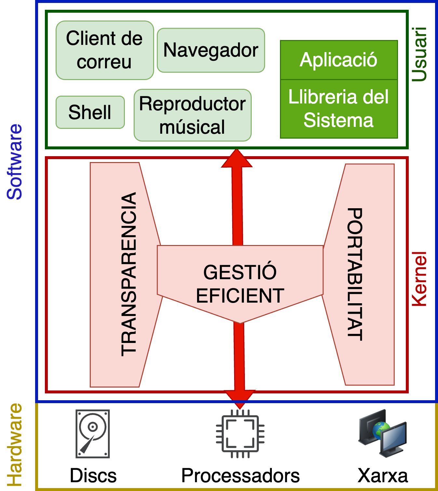{width="70%"}

:::
:::

## Què ofereix el sistema operatiu?

::: columns
::: {.column width="35%"}

### Serveis

> - Controlar usuaris i aplicacions.
> - Gestionar usuaris i aplicacions.
> - Gestionar la Memòria.
> - Sistema de fitxers.
> - Planificadors.
> - Eines de xarxa.

### Garanties

> - Seguretat.
> - Transparència.
> - Eficiència.
> - Portabilitat.
> - Estabilitat al llarg del temps.

:::
::: {.column width="60%"}

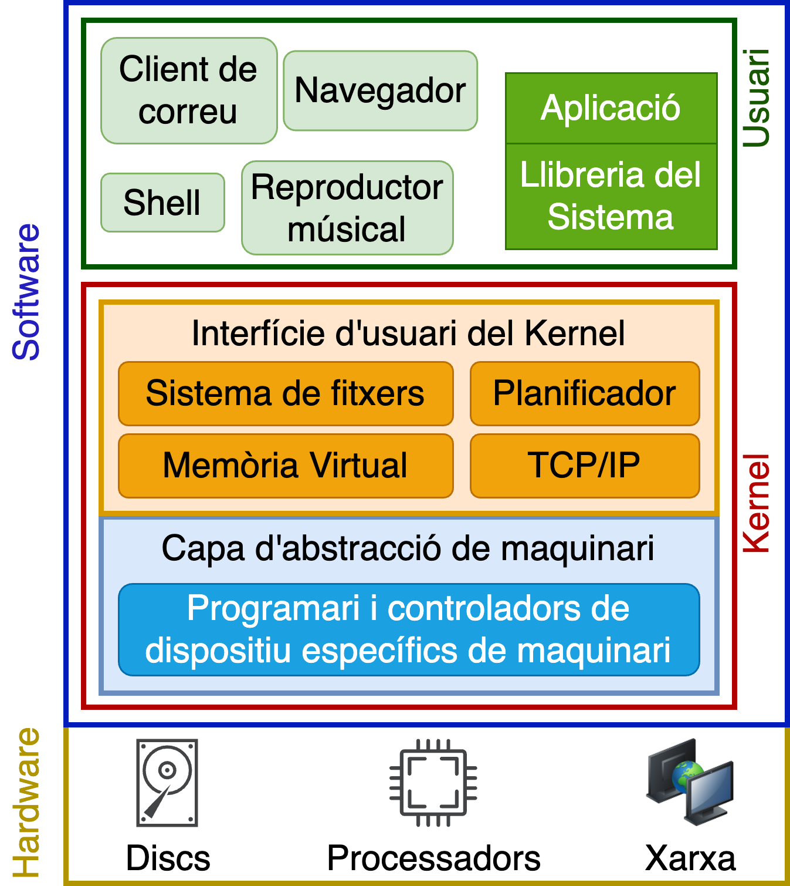{width="70%"}

:::
:::

## Quin sistema operatiu utilitzeu/coneixeu?

## Com s'organitza el sistema operatiu?

::: columns
::: {.column width="40%"}

\onslide<1->

:::center
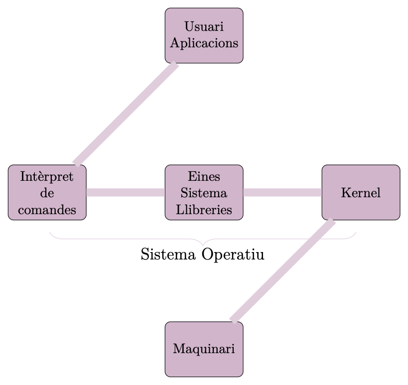{width="100%"}
:::

:::
::: {.column width="50%"}

\onslide<2->

### Maquina virtual

És la *visió* que té l'**usuari** del **sistema operatiu** durant una *sessió de treball*.

\onslide<3->

### Dualitat

El **sistema operatiu** divideix el programari que té [tots els privilegis]{.alert} (**kernel**) del programari que [no pot accedir a tots els recursos]{.alert} (**programes, llibreries, intèrpret de comandes,...**).

:::
:::

## Què és una Màquina Virtual?

La **virtualització** presentar una visió abstracta dels recursos del sistema. Diversos processos **creuen** (tenen l'il·lusió) de disposar sempre d'un conjunt de recursos (màquinaria).

> - **Simplicitat** \blueArrow Il·lusió de propietat de recursos
> - **Aïllament** \blueArrow Els bugs es donen en un entorn virtual i no físic.
> - **Protecció** \blueArrow Els processos no es poden fer mal entre ells.
> - **Portabilitat** \blueArrow Podem executar a totes les plataformes.

:::notes

**Recordeu**

Imagineu-vos que organitzem una LAN-party amb assistents, però només hi ha 1 pizza per alimentar-los. Com podem mostrar a cada un el seu propi tros de pizza i mantenir-los compromesos amb el nostre esdeveniment. Fàcil, creem 1 pizza virtual basada en la pizza real i donem a cada encarregat un tros de pizza virtual. Però, aquí ve un problema si tots els assistents mengen la pizza alhora, no funcionarà, alguns participants notarien el truc. Tanmateix, si programem els esdeveniments perquè molts participants s’ocupin de les activitats i no mengin la pizza, els organitzadors poden intercanviar en temps real la pizza real i la virtual a les taules on els participants descansen, perquè són els únics candidats a menjar i descobrir el truc, així que Si mengen, la pizza ha de ser real.

Java té un sandbox que permet utilitzar el Java independentment d'on executem.

VirtualBox i VMWare ens permeten executar sistemes operatius dins de sistemes operatius. Tenim un sistema operatiu amfitrió (màquina física) i un o més sistemes operatius virtuals (hostes).
També és possible virtualitzar sobre el hardware sense la necessitat d'un sistema operatiu (amfitrió).

També tenim virtualització per contenidors (Docker).
:::

## Què és la Memòria Virtual?

\onslide<1->

La *memòria virtual* permet que cada procés tingui la **il·lusió** que té accés exclusiu a [l'espai complet d'adreces de memòria del processador]{.alert}. En realitat els processos utilitzen **diferents regions de la memòria** de l'ordinador, amb algunes regions traslladades al *disc* [si no hi ha prou memòria]{.alert} per a tothom.

Aquesta **il·lusió** d'accés a tota la memòria la proporciona la unitat de **gestió de memòria (MMU)** d'un processador, que **tradueix** les *adreces virtuals* utilitzades pel programa en *adreces físiques* que representen ubicacions de memòria reals.

## Quins són els rols del sistema operatiu? (I)

\onslide<1->

::: center
[**Il·lusionista**]{.alert}

> - **Interfície Simple per als Recursos Físics**: Ofereix una interfície simple i fàcil d'utilitzar per als recursos físics d'una màquina o sistema, ocultant la complexitat tècnica.
:::

\onslide<2->

Permet als usuaris utilitzar una impressora (*hardware*) sense conèixer els detalls tècnics d'aquesta impresora, com la interfície de comunicació, els controladors o els protocols de comunicació, disposem d'una funció (**imprimir**) que ens permet enviar un document a la impressora.

## Quins són els rols del sistema operatiu? (II)

\onslide<1->

::: center
[**Il·lusionista**]{.alert}

> - **Ús Exclusiu de Recursos**: Proporciona una abstracció que permet a una aplicació tenir ús exclusiu dels recursos quan sigui necessari, sense interferències d'altres aplicacions.
:::

\onslide<2->

Permet utilitzar un programa de videoconferència que utilitza la càmera i el micròfon i ens garantitza que cap altre programa pugui utiltizar-los al mateix temps.

## Quins són els rols del sistema operatiu? (III)

\onslide<1->

::: center
[**Il·lusionista**]{.alert}

> - **Il·lusió d'Infinitat de Recursos de Maquinari:**: Oferir una il·lusió d'infinitat per als recursos de maquinari, assegurant que les aplicacions puguin continuar funcionant sense problemes.

:::

\onslide<2->

> - Permet a un usuari tenir múltiples aplicacions obertes alhora, tot i que només una estigui en primer pla.  
> - Crea una il·lusió on cada procés creu que és propietari dels recursos hardware.

## Quins són els rols del sistema operatiu? (IV)

\onslide<1->

::: center
[**Il·lusionista**]{.alert}

> - **Abstracció de Capacitats que no Estan Presentes Físicament**: Proporcionar abstraccions de capacitats que no estan físicament presents en el maquinari, com emuladors o màquines virtuals que executen sistemes operatius diferents.

:::

\onslide<2->

Execució de  múltiples sistemes operatius en una única màquina física. Per exemple, permet l'execució de Windows i Linux en una única màquina utilitzant diferents discs o particions.

## Virtualització de sistemes operatius

:::center
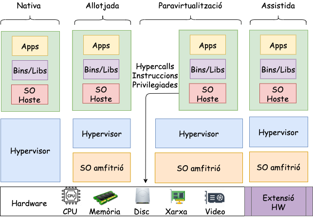{width=90mm}
:::

::: notes

- **Virtualització Nativa**: Hipervisor s'executa directament sobre el maquinari físic sense cap sistema operatiu intermedi. Exemples d'aquesta tecnologia inclouen VMware ESXi o Microsoft Hyper-V. Això ofereix un rendiment molt elevat, ja que no hi ha cap capa addicional entre el maquinari i l'hipervisor, ideal per a entorns de producció.
- **Virtualització Allotjada**: Hipervisor s'executa sobre un sistema operatiu ja existent. Per exemple, en KVM, s'utilitza Linux com a sistema operatiu base, i sobre aquest es creen les màquines virtuals.
- **Paravirtualització**: El sistema operatiu convidat sap que està sent virtualitzat i coopera amb l'hipervisor per millorar el rendiment. Un exemple destacat és Xen, que és molt utilitzat en entorns cloud per la seva eficiència.
- **Virtualització Assistida per Hardware**: Aquest model aprofita les capacitats del processador per accelerar el procés de virtualització. Processadors moderns com els d'Intel (VT-x) o AMD (AMD-V) ofereixen suport per a aquest tipus de virtualització (VMware o Hyper-V).

:::

## Quins són els rols del sistema operatiu? (V)

\onslide<1->

::: center
[**Àrbitre**]{.alert}

> - **Assignació de recursos**: Responsable de distribuir els recursos disponibles entre usuaris i aplicacions de manera eficient i justa.

:::

\onslide<2->

Un sistema amb múltiples usuaris, el temps de processador s'ha de repartir de manera equitativa entre tots els usuaris que executen aplicacions.

## Quins són els rols del sistema operatiu? (VI)

\onslide<1->

::: center
[**Àrbitre**]{.alert}

> - **Protecció/Aïllament**:  Garanteix la segregació i la protecció d'usuaris i aplicacions.

:::

\onslide<2->

Impedint que una aplicació bloquegi o afecti el funcionament d'altres aplicacions.

## Quins són els rols del sistema operatiu? (VII)

\onslide<1->

::: center
[**Pega**]{.alert}

> - **Conjunt de Serveis Comuns**:  Proporciona un conjunt de serveis i funcionalitats comunes que poden ser compartits i reutilitzats per diverses parts d'un sistema. **Compartició**: Simplifica SI s'assumeixen sempre les mateixes primitives bàsiques. **Reutilització**: Evita torna a implementar funcionalitats comunes. Permet evolucionar de forma independent els components.

:::

\onslide<2->

El **sistema operatiu** ens ofereix un [sistema de fitxers]{.alert}. Aquest servei gestiona la disposició física dels fitxers a l'emmagatzematge, controla l'accés als fitxers i ofereix una interfície per interactuar amb ells. A més a més, ens **proporciona lliberies i components** que permet als **desenvolupadors** utilitzar aquest servei de forma **transparent**. *(read, write, open, close, ...)*

## Anàlisi: Què fa aquest programa? (I)

::: columns
::: {.column width="45%"}

\onslide<1->

```c
#include <stdio.h>
#include <stdlib.h>

int main(int argc, char *argv[])
{
  while(1)
  {
    printf("%s\n", argv[1]);
  }
  return 0
}
```

:::
::: {.column width="50%"}

\onslide<2->

### `./prog H`

\onslide<3->

H
H
...

\onslide<4->

### `./prog H & ./prog O`

???
:::
:::

::: notes

:::

## Anàlisi: Què fa aquest programa? (II)

:::center
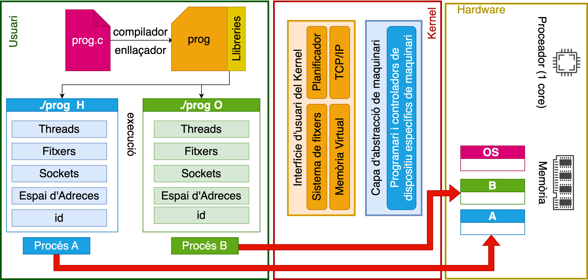{width=140mm}
:::

::: notes
En primer lloc, el programa c s'ha de compilar amb un compilador i enllaçar amb les llibreries del sistema que ens proporciona el sistema operatiu.

Un cop tenim un executable, si l'executem el sistema operatiu crearà una estructura anomenada procés on es guardarà un identificador, un espai de memòria,... aquesta estructura és una de les abstraccions essencials per la funció d'il·lusionisme.

Fixeu-vos que el mateix programa pot ser executat dos cops i el sistema operatiu generarà 2 processos diferents. Amb identificadors diferents i espai de memoria diferent.
:::

## Anàlisi: Què fa aquest programa? (III)

:::center
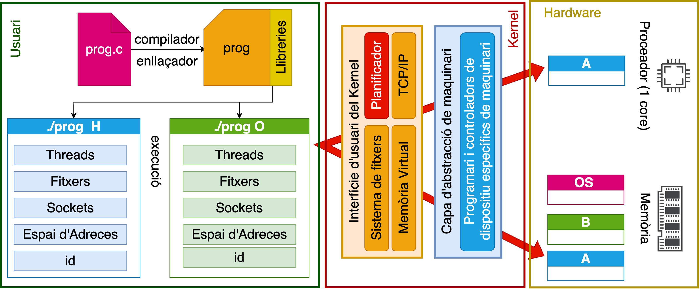{width=140mm}
:::

::: notes
Per tant, el sistema operatiu utilitzant el planificador assignarà el processador (assumimim que només tenim 1 core) a 1 procés durant un temps determinat i anirà intercanviant (canvi de context) aquest procés cada X temps, d'aquesta manera cada procés creu tenir tots els recursos per ells (il·lusió).
:::

## Anàlisi: Què fa aquest programa? (IV)

:::center
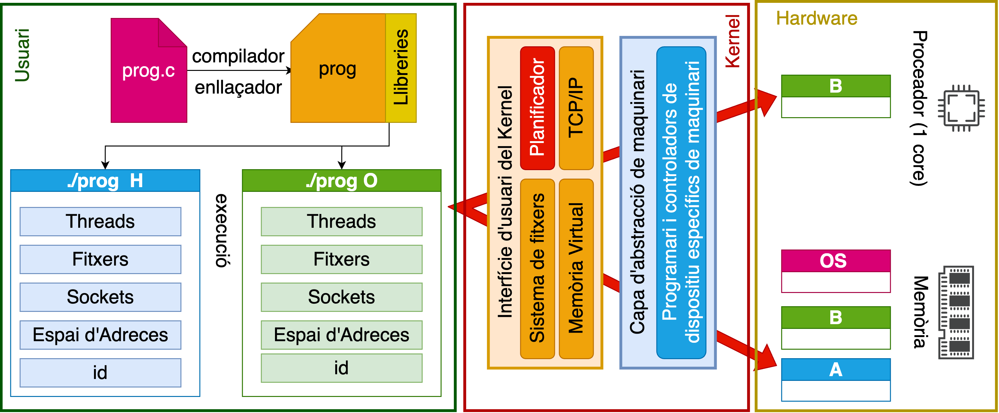{width=140mm}
:::

::: notes
Per fer-ho, el sistema operatiu guardà una foto de l'estat actual del procés a memòria i la recuperarà més endavant quan li torni a donar dret d'execució.

Noteu també que s'ha creat en mèmoria una subregió independent per cada procés. Quan un procés intenta accedir una zona de memòria forà de la seva subregió o inexistent es dona el famós SEGMENTATION FAULT.

Com en l'últim exemple on el procés intenta accedir a una zona de memòria que no li pertany. Això és una de les funcions de protecció que ens ofereix el sistema operatiu. Al llarg del curs veurem amb més detall com funcionen tots aquests mecanismes.
:::

## Anàlisi: Què fa aquest programa? (V)

::: columns
::: {.column width="45%"}

```c
#include <stdio.h>
#include <stdlib.h>

int main(int argc, char *argv[])
{
  while(1)
  {
    printf("%s\n", argv[1]);
  }
  return 0
}
```

:::
::: {.column width="50%"}

\onslide<2->

::: cbox
Depenen de la prioritat dels procesesos  **A** o **B** poden tenir més temps de *CPU* que l'altre i sortir els missatges de forma desordenada.
:::

\onslide<3->

### ./prog H & ./prog O

::: columns
::: {.column width="15%"}

:::
::: {.column width="20%"}
H
H
H
...

:::
::: {.column width="20%"}
H
O
H
...

:::
::: {.column width="20%"}
H
O
O
...

:::
::: {.column width="15%"}

:::
:::

:::
:::

## Anàlisi: Què fa aquest programa? (VI)

::: columns
::: {.column width="45%"}

\onslide<1->

```c
#include <stdio.h>
#include <stdlib.h>

int main(int argc, char *argv[])
{
  while(1)
  {
    printf("%s\n", argv[1]);
  }
  return 0
}
```

:::
::: {.column width="50%"}

### `./prog & ; ./prog O`

?????

:::
:::

## Anàlisi: Què fa aquest programa? (VII)

::: columns
::: {.column width="45%"}

\onslide<1->

```c
#include <stdio.h>
#include <stdlib.h>

int main(int argc, char *argv[])
{
  while(1)
  {
    printf("%s\n", argv[1]);
  }
  return 0
}
```

:::
::: {.column width="50%"}

### ./prog & ; ./prog O

Segmentation Fault
O
O
...

:::
:::

## Anàlisi: Què fa aquest programa? (VIII)

::: columns
::: {.column width="45%"}

\onslide<1->

```c
#include <stdio.h>
#include <stdlib.h>
#include <unistd.h>

int main(int argc, char *argv[])
{
  int *p = malloc(sizeof(int));
  printf("(%d) %p\n",getpid(),p);
  return 0
}
```

:::
::: {.column width="45%"}

\onslide<2->

### `./prog1`

```bash
(611) p: 0x5570014a02a0
(611) p: 1
(611) p: 2
(611) p: 3
(611) p: 4
```

\onslide<3->

### `./prog1 & ./prog1`

????

:::
:::

## Anàlisi: Què fa aquest programa? (IX)

::: columns
::: {.column width="45%"}

\onslide<1->

```c
#include <stdio.h>
#include <stdlib.h>
#include <unistd.h>

int main(int argc, char *argv[])
{
  int *p = malloc(sizeof(int));
  printf("(%d) %p\n",getpid(),p);
  return 0
}
```

:::
::: {.column width="45%"}

### ./prog1 & ./prog1

```bash
(611) p: 0x5570014a02a0
(612) p: 0x5570014a02a0
(611) p: 1
(612) p: 1
(611) p: 2
(612) p: 2
```

:::
:::

## Anàlisi: Què fa aquest programa? (X)

::: columns
::: {.column width="45%"}

\onslide<1->

```c
#include <stdio.h>
#include <stdlib.h>
#include <unistd.h>

int main(int argc, char *argv[])
{
  int *p = malloc(sizeof(int));
  *p = 0;
      while(1){
         *p= *p + 1
         printf("(%d) %p\n",getpid(),p);
      }
  return 0
}
```

:::
::: {.column width="45%"}

::: cbox
Les **adreçes virtuals** protegeixen els processosos entre ells i permeten que tots dos processos puguin fer servir la mateixa adreça sense afectar-se.
:::

:::
:::

## Reptes en el disseny dels sistemes operatius (I)

> - Complexitat de la **programació distribuïda** (*concurrent* i *paral·lela*).
> - Complexitat pel **context** (*mòbil, IoT, servidors, centres de dades*, ...).
> - Complexitat per la gran varietat d'elements de maquinari (**heterogeneïtat**).
> - Complexitat en la **portabilitat** i la **compatibilitat**.
> - Equilibri entre **funcionalitat** i **rendiment**.
> - Equilibri entre **rendiment** i **ús d'energia**.

## Reptes en el disseny dels sistemes operatius (II)

> - **Maximitzar la fiabilitat**: Els sistemes han de fer el que estan dissenyats per fer en tots els casos, fins i tot en cas d'errors inesperats.
> - **Maximitzar la disponibilitat**: Els sistemes han d'estar disponibles per a l'ús quan els usuaris ho necessiten, minimitzant el temps d'aturada i reparació causat per fallades.
> - **Seguretat**: Els sistemes han de protegir-se contra accions malicioses i accidents involuntaris.

\onslide<4->

Imagineu el **sistema operatiu** d'un *vehicle*. Aquest sistema ha de garantir que el *vehicle* no es pugui **controlar de forma remota** per un atacant. També ha de ser **tolerant a fallades** i **recuperar-se d'errors** sense posar en perill la seguretat dels *passatgers*.

## Reptes en el disseny dels sistemes operatius (III)

> - **Escalables**: Els sistemes han de funcionar bé quan s'afegeixen recursos (usuaris, processos, ...) o quan es redueixen.
> - **Mantenibles**: Els sistemes han de ser fàcils de mantenir i evolucionar al llarg del temps.

\onslide<3->

El **sistema operatiu** d'un telèfon mòbil ha de ser **escalable** perquè el nombre d'usuaris pot augmentar molt ràpidament. També ha de ser **mantenible** perquè els usuaris esperen actualitzacions periòdiques del **sistema operatiu**. A més a més, aquestes *actualitzacions* s'han de poder *instal·lar* de forma *transparent i sense afectar el funcionament del telèfon*.

## Per què estudiar Sistemes Operatius?

> - Els sistemes operatius són la base dels sistemes informàtics. (IoT, Servidors, Mòbils, PC, ...).
> - Els sistemes operatius ens permeten entendre com funciona *realment* un sistema informàtic.
> - Els conceptes bàsics dels sistemes operatius són aplicables a altres sistemes i problemes quotidians (**planificació de tasques**).
> - Optimitzar el rendiment de les aplicacions.
> - Compendre les vulnerabilitats, proteccions i mitigacions de riscos de seguretat.

\onslide<6->

::: center
La comprensió en les decisions de disseny dels sistemes operatius i el raonament sobre els pros/contra us permetrà rescatar idees obsoletes que poden ser útils en el futur dels nous sistemes informàtics.
:::

::: notes

En particular, sovint passa que un canvi en la tecnologia fa que alguns
idea obsoleta i ràpidament desapareix. No obstant això, un altre canvi tecnològic podria tornar-lo a reviure. Això és especialment cert quan el canvi té a veure amb el rendiment relatiu de les diferents parts del sistema. Per exemple, quan les CPUs es van fer molt més ràpides que les Memòries les caches van gaunyar molta importancia, però que passa si en un futur les memòries són molt més ràpides que les CPUs? En aquest cas, les caches ja no serien necessàries. En biologia, l'extinció és per sempre, però en informàtica, de vegades només és per uns quants anys.
:::

## Conclusions

> - Els **sistemes operatius** estan presents en tots els dispositius que fem servir.
> - El *disseny* dels **sistemes operatius** es **complex** i requereix integrar dispositius diferents (*forma,espai,temps*).
> - Els sistema operatius ens proporciona una il·lusió d'una màquina virtual infinita.
> - El **sistema operatiu** és *il·lusionista*, *árbrit* i proporciona un conjunt de serveis comuns per permetre la interacció entre programari i maquinari.
> - Un **sistema operatiu** té cura del **rendiment, seguretat, portabilitat i fiabilitat**.

## Això és tot per avui

::: center
[**PREGUNTES?**]{.alert}

:::

::: columns
::: {.column width="50%"}

### Materials del curs

- **Organització**   --- [OS-GEI-IGUALADA-2425](https://github.com/OS-GEI-IGUALADA-2425)
- **Materials**    --- [Materials del curs](https://github.com/OS-GEI-IGUALADA-2425/materials)
- **Laboratoris**  --- [Laboratoris](https://github.com/OS-GEI-IGUALADA-2425/laboratoris)
- **Recursos**    --- [Campus Virtual](https://cv.udl.cat/)

[**TAKE HOME MESSAGE**]{.alert}: Els **sistemes operatius** ajuden als programadors a desenvolupar programari robust de forma independent del maquinari.

:::
::: {.column width="45%"}

:::center
{width=40mm}
:::

:::
:::
